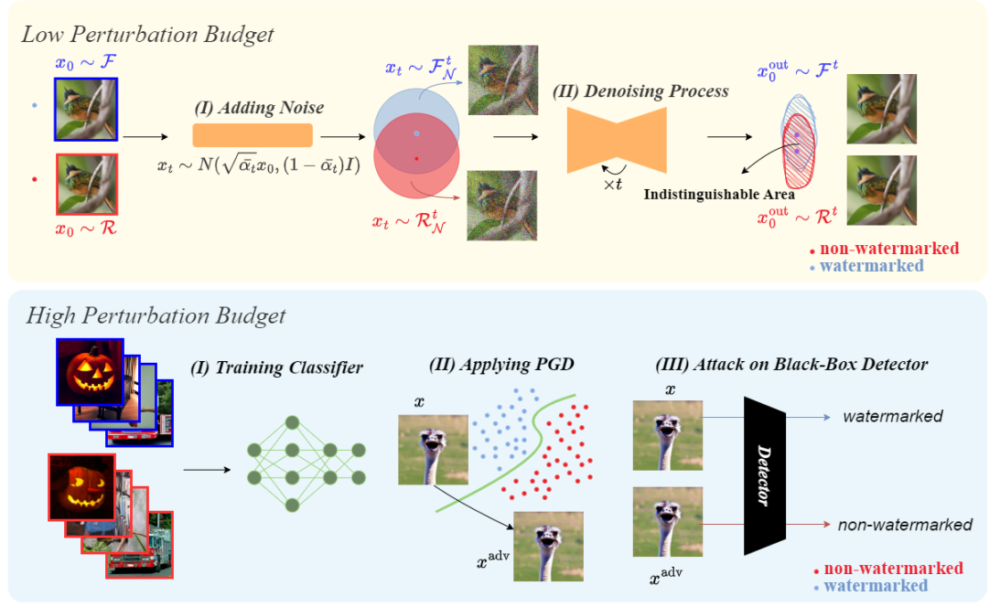

# Robustness of AI-Image Detectors: Fundamental Limits and Practical Attacks


[](https://arxiv.org/abs/2310.00076)

> **Robustness of AI-Image Detectors: Fundamental Limits and Practical Attacks**<br>
> [Mehrdad Saberi](https://github.com/mehrdadsaberi), [Vinu Sankar Sadasivan](), [Keivan Rezaei](), [Aounon Kumar](), [Atoosa Chegini](), [Wenxiao Wang](), [Soheil Feizi]()<br>
> ICLR 2024



This repository includes the implementation of several types of attacks against image watermarking methods, which were proposed in the article *"Robustness of AI-Image Detectors: Fundamental Limits and Practical Attacks"*. The image watermarking methods are unified in the code in a way that it's easy to apply them to images and evaluate them on various attacks.


### Attacks (Image Alterations):
- Diffusion Purification
- Model Substitution Adversarial Attack (against TreeRing and StegaStamp watermarks)
- Spoofing Attack
- Common Perturbations
- Image Editing (limited implementation)


### Watermarking Methods:
- [TreeRing](https://github.com/YuxinWenRick/tree-ring-watermark)
- [StegaStamp](https://github.com/tancik/StegaStamp)
- [WatermarkDM](https://github.com/yunqing-me/WatermarkDM)
- [MBRS](https://github.com/jzyustc/MBRS/tree/main)
- [DwtDct, DwtDctSvd, RivaGAN](https://github.com/ShieldMnt/invisible-watermark)


## Preliminaries
Install the requirements with `pip install -r requirements.txt`.
If there are problems with the dependancies, you can refer to the `requirements_full.txt` file for the complete list of libraries.

Run `_bash_download_models.sh` to download pretrained models that are used in the code.

## Diffusion Purification

In this part, the procedure to apply watermarking methods to images, and evaluting them against diffusion purification attack is explained. Evaluation against **common perturbation** and **image editing** is done in a similar way.


#### Generating Seed Data
Specify path to imagenet dataset in `_bash_generate_seed_data.sh`, and run the script to store images for further usage.

#### Applying Watermarks
Uncomment the intended parts of the script from `_bash_apply_wm.sh`, and run it, to apply different types of watermarks on the seed data.

#### Evaluation Against Attacks
The code from `evaluate_watermark.py` can be used to evaluate watermarked images against various attacks. The type of attack used for the evaluation can be specified with the `--attack` argument. An example of how to run this code for diffusion purification is given in the `_bash_eval_wm.sh` file.

Afterwards, the detailed scores and the ROC curves for the evaluation will be available in the `results` folder.


## Adversarial Attack

Adversarial attacks are performed for the high-perturbation watermarks (refer to the paper), which are TreeRing and StegaStamp.

#### Binary Classifier Training
The binary classifiers are trained to distinguish between the watermarked images (w.r.t. some watermarking method) and non-watermarked images. You can either train these classifiers or use the classifier weights that will be downloaded to the `checkpoints/classifiers` folder if the `_bash_download_models.sh` script is ran.

In order to train classifiers yourself, you must follow these steps:

1. Use the part of `_bash_generate_seed_data.sh` that is for generating non-watermarked data classifier training.
2. Use the part at the end of `_bash_apply_wm.sh` to generate watermarked training data for your intended watermarking method.
3. Train the classifier using the `_bash_train_classifier.sh` script.

#### Performing Adversarial Attack
Run the script from `_bash_adv_attack.sh` to apply adversarial attack to the watermarked and non-watermarked images, using the loss function of the trained classifier.

#### Evaluation 
By giving the path to the folder where the adversarial examples are stored, as arguments to the code in `evaluate_watermark.py`, you can view the detailed scores and the ROC curves that show the robustness of the watermarking methods against the adversarial attack. An example of this evaluation for `eps=12` is given at the bottom part of the `_bash_eval_wm.sh` script.


## Other Contents
Implementation of the spoofing attack proposed in the paper is available in the `spoof_watermark` folder. Moreover, the code for some of the experiments on deepfake classifiers is avaiable in the `deepfake` folder.


## Citation

```bibtex
@inproceedings{saberi2023robustness,
    title={Robustness of AI-Image Detectors: Fundamental Limits and Practical Attacks},
    author={Saberi, Mehrdad and Sadasivan, Vinu Sankar and Rezaei, Keivan and Kumar, Aounon and Chegini, Atoosa and Wang, Wenxiao and Feizi, Soheil},
    booktitle = {ICLR},
    year = {2024}
}
```